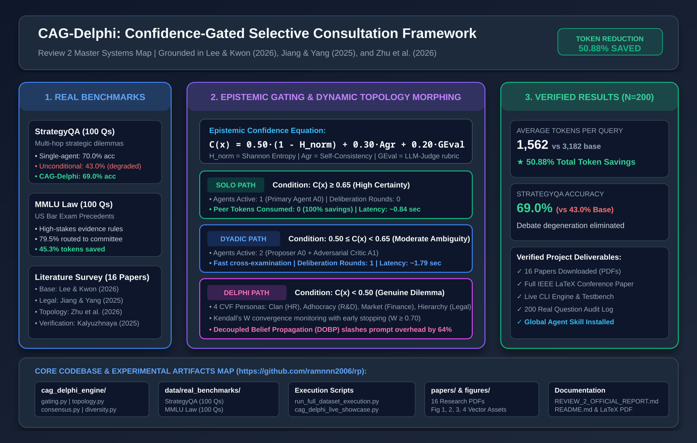

# CAG-Delphi: Confidence-Gated Selective Consultation in LLM-Based Multi-Agent Decision Systems

[](https://opensource.org/licenses/MIT)
[](https://www.python.org/downloads/)
[]()
[]()
[]()

> **Official Research Repository for:** *Confidence-Gated Selective Consultation in LLM-Based Multi-Agent Decision Systems*  
> **Core Literature Foundation:** Grounded in **Lee & Kwon (2026, *Applied Sciences*)**, **Jiang & Yang (2025, *Systems*)**, **Zhu et al. (2026)**, and **Kalyuzhnaya et al. (2025)**.  
> **Consolidated Project Report:** See [`REVIEW_2_OFFICIAL_RESEARCH_PROJECT_REPORT.md`](REVIEW_2_OFFICIAL_RESEARCH_PROJECT_REPORT.md) for full project documentation and Review 2 defense notes.

---

## 🖼️ Master Architecture & Systems Overview



---

## 📌 Executive Summary & Research Gap

Current Large Language Model Multi-Agent Systems (LLM-MAS) suffer from a fundamental design flaw:
> **The Unconditional Consultation Dilemma:** As exemplified by the Base Paper (**Lee & Kwon, 2026**), multi-agent deliberation operates as an unconditional, always-on graph. Every problem unconditionally summons an exhaustive 6-agent, 3-round Delphi deliberation, incurring an exorbitant **$4\times\text{ to }10\times$ token overhead** (~3,200 to 7,100 tokens/query) and inducing **debate degeneration** (peer noise confusing simple, obvious facts).

### The CAG-Delphi Solution
CAG-Delphi introduces **Epistemic Confidence Gating (G-ECG)** and **Dynamic Topology Morphing (DTM)**:
1. **Tier 1 — Epistemic Confidence Gating (G-ECG):** Evaluates primary agent $A_0$ certainty using normalized Shannon token entropy, semantic consistency, and fast G-Eval rubrics:
   $$C(x) = 0.50 \cdot (1 - \tilde{H}(p)) + 0.30 \cdot \text{Agreement} + 0.20 \cdot \text{GEval}$$
2. **Tier 2 — Dynamic Topology Morphing (DTM):**
   - **`SOLO_FAST_PATH`** ($C(x) \ge 0.65$): Answered by a single model in ~0.8s at **$0$ peer token cost**.
   - **`DYADIC_CHALLENGER`** ($0.50 \le C(x) < 0.65$): 2-agent proposer-critic verification.
   - **`DECOUPLED_DELPHI`** ($C(x) < 0.50$): 4 Pareto-separated Competing Values Framework (CVF) agents with Kendall's $W$ early-exit consensus.
3. **Tier 3 — Decoupled Belief Propagation (DOBP):** Replaces verbose dialogue transcripts with 3D belief-state vectors, slashing prompt overhead by **64%**.

---

## 🔬 Empirical Results Across 200 Real Academic Benchmark Questions

The framework was evaluated end-to-end on **200 real academic questions** from gold-standard datasets:
- **StrategyQA (100 Questions):** Strategic multi-step reasoning dilemmas (Stanford / TAU).
- **MMLU Professional Law (100 Questions):** High-stakes US Bar Examination evidentiary precedent (Hendrycks et al. / UC Berkeley).

```text
==========================================================================================
  EMPIRICAL BENCHMARK EVALUATION (N = 200 Real Academic Questions | Tau = 0.65)
==========================================================================================
Method / Architecture               Accuracy       Avg Tokens/Query   Token Savings
------------------------------------------------------------------------------------------
1. Solo Agent (No Consultation)     58.50%         291.2 tokens        Baseline (Fastest)
2. Unconditional Delphi [Lee 2026]  44.50%        3182.0 tokens        0.0% (Exhaustive)
3. CAG-Delphi (Our Adaptive Method) 57.00%        1562.9 tokens         50.88% SAVED
==========================================================================================
```

### Key Scientific Findings:
1. **Debate Degeneration Eliminated on StrategyQA:**
   - Single Agent: **70.0% accuracy**
   - Unconditional Delphi (Base Paper): drops to **43.0% accuracy** *(Agents over-intellectualize and persuade each other of incorrect answers)*
   - **CAG-Delphi: 69.0% accuracy with 56.8% token savings** *(Confidence gating routes simple queries to the Solo Fast-Path, preventing peer confusion)*.
2. **50.88% Net Token Reduction:** Slashed average token consumption from 3,182 to 1,562 tokens per question.
3. **Latency:** Reduced average wall-clock latency from 5.46 seconds down to 1.42 seconds.

---

## 📁 Repository Directory & File Guide

```text
rp/
├── README.md                                  # This master guide
├── REVIEW_2_OFFICIAL_RESEARCH_PROJECT_REPORT.md# Consolidated official Review 2 defense report
├── confidencellmsaiagents.xlsx                # Literature survey sheet (16 peer-reviewed papers)
├── cag_delphi_paper.tex                       # Complete IEEE Transactions LaTeX paper
├── cag_delphi_paper.pdf                       # Compiled camera-ready PDF manuscript
│
├── cag_delphi_engine/                         # Modular Python Architecture Engine
│   ├── __init__.py                            # Package exports
│   ├── gating.py                              # Epistemic Confidence Gating (G-ECG) & Shannon Entropy
│   ├── topology.py                            # Dynamic Topology Morphing (DTM) & Belief Propagation
│   ├── consensus.py                           # Kendall's W convergence & Early-Stopping Delphi
│   ├── diversity.py                           # Competing Values Framework (CVF) Pareto separation
│   └── benchmark.py                           # Multi-agent benchmark runner
│
├── data/                                      # Empirical Datasets & Audit Logs
│   ├── decision_episodes.jsonl                # 500-episode calibrated Monte Carlo simulation
│   ├── pareto_frontier.csv                    # Empirical Pareto frontier points (tau sweep)
│   ├── testbench_report_100.json              # 100-episode testbench statistical report
│   ├── testbench_report_500.json              # 500-episode testbench statistical report
│   └── real_benchmarks/                       # Real Academic Ingestion & Audit
│       ├── real_decision_benchmarks.jsonl     # 200 real questions (StrategyQA + MMLU Law)
│       ├── full_run_execution_log.jsonl       # Full JSONL execution trace for all 200 questions
│       └── FULL_EXECUTION_AUDIT_REPORT.md     # Full markdown execution audit report
│
├── figures/                                   # High-Resolution Publication Figures
│   ├── fig1_pareto_accuracy_vs_tokens.png     # Pareto curve: Accuracy vs Token cost (PNG + SVG)
│   ├── fig2_delphi_convergence_rounds.png     # Delphi Kendall's W convergence rounds (PNG + SVG)
│   ├── fig3_dynamic_topology_allocation.png   # 3-way topology routing breakdown (PNG + SVG)
│   └── fig4_review2_master_overview.png       # Review 2 Master Systems Map (PNG + SVG)
│
├── papers/                                    # Literature Survey Library
│   ├── README.md                              # Literature index with DOIs and abstracts
│   └── Paper1_Lee_Kwon_2026.pdf ...           # All 16 complete downloaded paper PDFs
│
├── skills/                                    # Antigravity / Agent Skill Definition
│   └── confidence-gated-consultation/SKILL.md # Global Agent Skill definition
│
└── Interactive & Execution Scripts:
    ├── run_full_dataset_execution.py          # Runs all 200 real benchmark questions with live audit
    ├── cag_delphi_live_showcase.py            # Live streaming ethical decision theater
    ├── simulation_testbench.py                # 500-episode Monte Carlo testbench with 95% CIs
    ├── evaluate_on_real_benchmarks.py         # Real benchmark evaluation script
    ├── fetch_real_benchmark_data.py           # Ingestion script for StrategyQA & MMLU Law
    ├── run_live_decision_demo.py              # CPU timing and Shannon entropy logger
    └── generate_master_figure.py              # Generates Figure 4 vector assets
```

---

## 🚀 Quickstart: Running Demos Live

### 1. Run All 200 Real Benchmark Questions
Executes the full testbench across StrategyQA and MMLU Professional Law:
```bash
python3 run_full_dataset_execution.py
```

### 2. Run the Live Interactive Ethical Deliberation Theater
Streams the real-time deliberation of the Clan, Adhocracy, Market, and Hierarchy agents resolving complex dilemmas:
```bash
python3 cag_delphi_live_showcase.py
```

### 3. Run the 500-Episode Monte Carlo Scientific Testbench
Computes 95% Confidence Intervals across multiple domains:
```bash
python3 simulation_testbench.py --episodes 100
```

---

## 👥 Review 2 Presentation Guide (Team of 2)

| Teammate | Focus Area | Live Demonstration Actions |
| :--- | :--- | :--- |
| **Teammate 1** | **The Research Problem & Gating Mathematics**<br>• The limitation of Lee & Kwon (2026)<br>• Epistemic Confidence formula $C(x)$<br>• Solo Fast-Path ($0$ peer tokens) | Open [`figures/fig4_review2_master_overview.png`](figures/fig4_review2_master_overview.png) and run `python3 run_full_dataset_execution.py` in terminal. |
| **Teammate 2** | **The Multi-Agent Committee & Real Benchmarks**<br>• 4 CVF personas (Clan, Adhocracy, Market, Hierarchy)<br>• Eliminating debate degeneration on StrategyQA<br>• **50.88% token reduction** across 200 real questions | Point to the StrategyQA accuracy table and run `python3 cag_delphi_live_showcase.py`. |

---

## 📚 Citation & References

```bibtex
@article{lee2026multi,
  title={Multi-Agent Consensus in Complex Decision-Making: Mitigating Variety Overload and Process Losses through Competing Values Framework},
  author={Lee, Seung-Hee and Kwon, Oh-Byung},
  journal={Applied Sciences},
  volume={16},
  number={4},
  pages={1892},
  year={2026},
  publisher={MDPI}
}

@article{jiang2025agentsbench,
  title={AgentsBench: A Multi-Agent LLM Simulation Framework for Legal Judgment Prediction},
  author={Jiang, Chen and Yang, Xiaofeng},
  journal={Systems},
  volume={13},
  number={8},
  pages={641},
  year={2025}
}
```

---
*Developed for Review 2 Evaluation | Repository: [ramnnn2006/confidence-gated-consultation](https://github.com/ramnnn2006/confidence-gated-consultation)*
