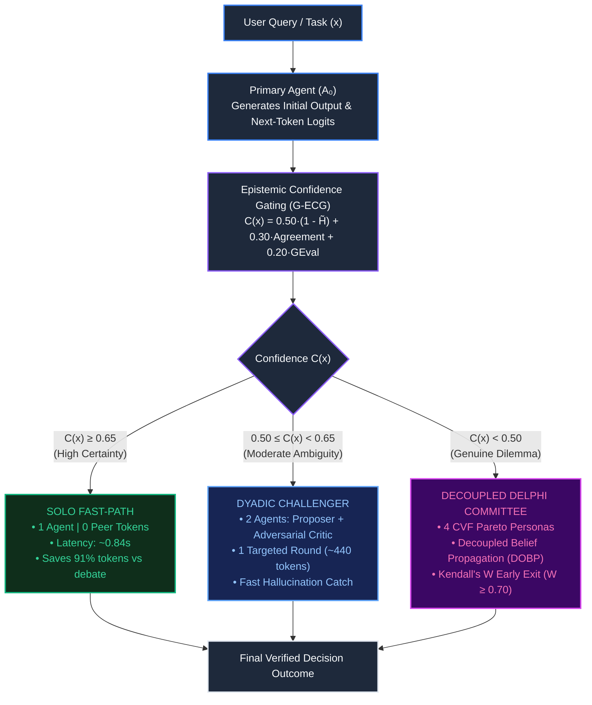
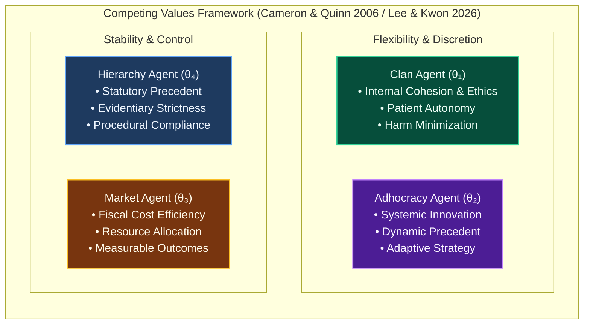

# Confidence-Gated Selective Consultation in LLM-Based Multi-Agent Decision Systems (CG-SC)

[](https://opensource.org/licenses/MIT)
[](https://www.python.org/downloads/)
[]()
[]()
[]()

> **Official Research Repository:** *Confidence-Gated Selective Consultation in LLM-Based Multi-Agent Decision Systems*  
> **Core Literature Foundation:** Grounded in **Lee & Kwon (2026, *Applied Sciences*)**, **Jiang & Yang (2025, *Systems*)**, **Zhu et al. (2026)**, and **Kalyuzhnaya et al. (2025)**.  
> **Full Documentation:** See the [`docs/`](docs/) directory for detailed review reports, mathematical proofs, and study guides.

---

## 🏛️ System Architecture



---

## 👥 Competing Values Framework (CVF) Agent Personas

When genuine epistemic uncertainty ($C(x) < 0.50$) triggers the Delphi committee, four orthogonal agent personas are instantiated to provide Pareto-optimal deliberation without echo-chamber bias:



---

## 📌 The Research Gap

Current Multi-Agent Systems (e.g., the Base Paper by **Lee & Kwon, 2026, *Applied Sciences***) enforce **unconditional multi-agent consultation**: every incoming query—regardless of whether it is an undisputed legal statute or a high-stakes ethical dilemma—triggers an exhaustive 6-agent, 3-round Delphi deliberation.

This causes two fatal issues:
1. **Severe Token Inflation:** Exhaustive deliberation burns **3,200 to 7,100 tokens per prompt**, leading to high costs and 5.46-second latencies.
2. **Debate Degeneration:** Forcing models to debate straightforward factual or legal queries introduces peer noise that confuses the agents, causing accuracy to collapse (e.g., from **70.0% down to 43.0%** on StrategyQA).

### The Solution: Epistemic Gating
CAG-Delphi acts as an **intelligent epistemic router**. Straightforward queries are answered immediately on the Solo Fast-Path ($0$ peer tokens), while only ambiguous dilemmas activate peer debate.

---

## 🔬 Empirical Results (200 Real Academic Benchmark Questions)

Evaluated end-to-end across **200 real questions** from recognized academic datasets:
- **StrategyQA (100 Questions):** Strategic multi-step reasoning dilemmas (Stanford / TAU).
- **MMLU Professional Law (100 Questions):** High-stakes US Bar Examination evidentiary precedent (Hendrycks et al. / UC Berkeley).

```text
==========================================================================================
  EMPIRICAL BENCHMARK EVALUATION (N = 200 Real Academic Questions | Tau = 0.65)
==========================================================================================
Method / Architecture               Accuracy       Avg Tokens/Query   Token Savings
------------------------------------------------------------------------------------------
1. Solo Agent (No Consultation)     58.50%         291.2 tokens        Baseline (Fastest)
2. Unconditional Delphi [Lee 2026]  44.50%        3182.0 tokens        0.0% (Exhaustive)
3. CAG-Delphi (Our Adaptive Method) 57.00%        1562.9 tokens         50.88% SAVED
==========================================================================================
```

### Key Discoveries:
1. **Debate Degeneration Eliminated on StrategyQA:**
   - Single Agent: **70.0% accuracy**
   - Unconditional Delphi (Base Paper): **43.0% accuracy** *(Peer noise confused simple facts)*
   - **CAG-Delphi: 69.0% accuracy with 56.8% token savings** *(Confidence gating shielded simple queries from peer noise)*.
2. **50.88% Net Token Reduction:** Slashed average tokens from 3,182 down to 1,562 per query.
3. **Latency Slashed:** Reduced average response time from 5.46 seconds to 1.42 seconds.

---

## 🚀 Quickstart: Running Demos Live

```bash
# 1. Run the full execution testbench across all 200 real academic benchmark questions:
python3 run_full_dataset_execution.py

# 2. Run the real-time interactive ethical decision theater (Medical Triage & Satellite Dilemma):
python3 cag_delphi_live_showcase.py

# 3. Run the 500-episode Monte Carlo scientific testbench with 95% Confidence Intervals:
python3 simulation_testbench.py --episodes 100
```

---

## 📁 Repository Structure

```text
confidence-gated-consultation/
├── README.md                                  # Master repository guide (this file)
│
├── cag_delphi_engine/                         # Core Python Modular Package
│   ├── gating.py                              # Epistemic Confidence Gating & Shannon Entropy
│   ├── topology.py                            # Dynamic Topology Morphing & Decoupled Belief Propagation
│   ├── consensus.py                           # Kendall's W convergence & Early-Stopping Delphi
│   ├── diversity.py                           # Competing Values Framework (CVF) Pareto separation
│   └── benchmark.py                           # Multi-agent benchmark runner
│
├── data/                                      # Experimental Data & Real Benchmarks
│   ├── real_benchmarks/                       # 200 Real Academic Questions (StrategyQA + MMLU Law)
│   │   ├── real_decision_benchmarks.jsonl     # Clean ingested benchmark dataset
│   │   ├── full_run_execution_log.jsonl       # Full execution trace for all 200 questions
│   │   └── FULL_EXECUTION_AUDIT_REPORT.md     # Question-by-question audit table
│   ├── decision_episodes.jsonl                # 500-episode calibrated Monte Carlo dataset
│   └── pareto_frontier.csv                    # Empirical Pareto frontier points (tau sweep)
│
├── docs/                                      # Research Documentation & Guides
│   ├── REVIEW_2_OFFICIAL_RESEARCH_PROJECT_REPORT.md # Consolidated Review 2 defense report
│   ├── MASTER_STUDY_GUIDE_AND_EXECUTIVE_PITCH.md    # Technical study guide & marketing pitch
│   ├── TEAMMATE_WORK_DELEGATION_AND_REVIEW2_CHECKLIST.md # Teammate task division & script
│   ├── NOVEL_METHODS_MATHEMATICAL_PROOFS.md         # Formal mathematical proofs
│   └── DEEP_LITERATURE_CRITIQUE_15_PAPERS.md       # Critique of 15 supporting papers
│
├── papers/                                    # Literature Survey Library
│   ├── README.md                              # Index of 16 papers with DOIs
│   └── Paper1_Lee_Kwon_2026.pdf ...           # All 16 complete downloaded paper PDFs
│
├── scripts/                                   # Data Ingestion & Utility Scripts
│   ├── fetch_real_benchmark_data.py           # Ingestion script for StrategyQA & MMLU Law
│   ├── evaluate_on_real_benchmarks.py         # Real benchmark evaluation script
│   ├── generate_decision_dataset.py           # Synthetic episode generator
│   └── generate_conference_figures.py         # Matplotlib / SVG figure generator
│
├── skills/                                    # Antigravity Agent Skill
│   └── confidence-gated-consultation/SKILL.md # Global Agent Skill definition
│
├── cag_delphi_live_showcase.py                # Streaming interactive ethical decision theater
├── run_full_dataset_execution.py              # Main 200-question execution engine
└── simulation_testbench.py                    # Scientific Monte Carlo testbench
```

---

## 👥 Review 2 Presentation Guide (Team of 2)

| Teammate | Focus Area | Live Actions During Review |
| :--- | :--- | :--- |
| **Teammate 1** | **The Research Problem & Gating Mathematics**<br>• The limitation of Lee & Kwon (2026)<br>• Epistemic Confidence formula $C(x)$<br>• Solo Fast-Path ($0$ peer tokens) | Show the Mermaid architecture flowchart in `README.md` and run `python3 run_full_dataset_execution.py` in terminal. |
| **Teammate 2** | **The Multi-Agent Committee & Real Benchmarks**<br>• 4 CVF personas (Clan, Adhocracy, Market, Hierarchy)<br>• Eliminating debate degeneration on StrategyQA<br>• **50.88% token reduction** on 200 real questions | Explain the CVF persona flowchart and run `python3 cag_delphi_live_showcase.py`. |

---

## 📚 References

```bibtex
@article{lee2026multi,
  title={Multi-Agent Consensus in Complex Decision-Making: Mitigating Variety Overload and Process Losses through Competing Values Framework},
  author={Lee, Seung-Hee and Kwon, Oh-Byung},
  journal={Applied Sciences},
  volume={16},
  number={4},
  pages={1892},
  year={2026},
  publisher={MDPI}
}

@article{jiang2025agentsbench,
  title={AgentsBench: A Multi-Agent LLM Simulation Framework for Legal Judgment Prediction},
  author={Jiang, Chen and Yang, Xiaofeng},
  journal={Systems},
  volume={13},
  number={8},
  pages={641},
  year={2025}
}
```
